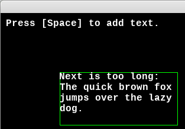

# Experiment 2 - Monospaced Text

This is an attempt to create a simple text/console type of window. Print text
to it, render it, and scroll up when you reach the bottom. Think of the
text area in the bottom-right of the
[Ultima V](https://wiki.ultimacodex.com/wiki/File:U5amig.jpg), for example.

We'll make an area that can display five lines of 20 characters each. It
automatically wraps lines that are too long, and there's a rectangle around
the text area so you can be sure it's not over-drawing.



You can run it from this directory with:

```sh
./python3 main.py
```

If you're using Sublime Text:

1. Open the project.
1. Under Tools -> Build System, choose "Pygame - Main". You only need to pick
   the build system once, it's stored in the workspace file.
1. Choose Tools -> Build or press its shortcut (Ctrl+B).

Press Escape to exit the demo.

## Credits

This is written in Python 3, using the [PyGame](https://www.pygame.org/news) 2D
game engine.

### Graphics

* `LiberationMono-Bold.ttf` - An open source font from the
  [liberationfonts](https://github.com/liberationfonts/liberation-fonts) repo;
  this is licensed under the
  [SIL Open Font License](https://github.com/liberationfonts/liberation-fonts/blob/master/LICENSE).
