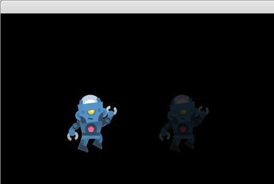

# Experiment 5 - Image Fades

In this experiment, we'll fade some images from black to fully-drawn using a
couple different techniques, to compare how they look.



You can run it from this directory with:

```sh
./love .
```

If you're using Sublime Text:

1. Open the project.
1. Under Tools -> Build System, choose "Launch Löve2D". You only need to pick
   the build system once, it's stored in the workspace file.
1. Choose Tools -> Build or press its shortcut (Ctrl+B).

Press Escape to exit the demo.

## Credits

This is written in Lua, using the [LÖVE](https://love2d.org/) 2D game engine. I
didn't know about that until I stumbled on [CS50's Introduction to Game
Development](https://www.edx.org/course/cs50s-introduction-to-game-development).

Check the `.lua` file headers for individual credits; stuff I wrote is released
under the [MIT license](LICENSE.md).

### Graphics

* `character_robot_jump.png` - From Kenney.nl's freely usable
  [Toon Characters 1](https://kenney.nl/assets/toon-characters-1) collection.
