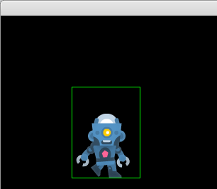

# Experiment 7 - Animated Icon

In this experiment, we'll draw an animated icon.



You can run it from this directory with:

```sh
python3 main.py
```

If you're using Sublime Text:

1. Open the project.
1. Under Tools -> Build System, choose "Pygame - MainD". You only need to pick
   the build system once, it's stored in the workspace file.
1. Choose Tools -> Build or press its shortcut (Ctrl+B).

Press Escape to exit the demo.

## Credits

This is written in Python 3, using the [PyGame](https://www.pygame.org/news) 2D game engine.

### Graphics

* `character_robot_sheet.png` - From Kenney.nl's freely usable
  [Toon Characters 1](https://kenney.nl/assets/toon-characters-1) collection.
