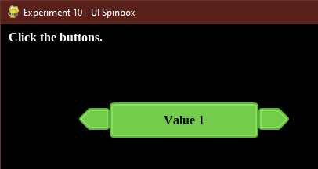

# Experiment 10 - UI Spinbox

In this experiment, we'll draw a spinbox with some text in it. It'll respond
to the mouse hovering over it, and clicks, switching between a set of values.



You can run it from this directory with:

```sh
python3 main.py
```

or:

```sh
python main.py
```

If you're using Sublime Text:

1. Open the project.
1. Under Tools -> Build System, choose "Pygame - Main". You only need to pick
   the build system once, it's stored in the workspace file.
1. Choose Tools -> Build or press its shortcut (Ctrl+B).

Press Escape to exit the demo.

## Credits

This is written in Python 3, using the [PyGame](https://www.pygame.org/news) 2D
game engine.

### Graphics

* `uipack` - [Kenney.nl's UI Pack](https://kenney.nl/assets/ui-pack).

Font:

* `LiberationSerif-Bold.ttf` - An open source font from the
  [liberationfonts](https://github.com/liberationfonts/liberation-fonts) repo;
  this is licensed under the
  [SIL Open Font License](https://github.com/liberationfonts/liberation-fonts/blob/master/LICENSE).
