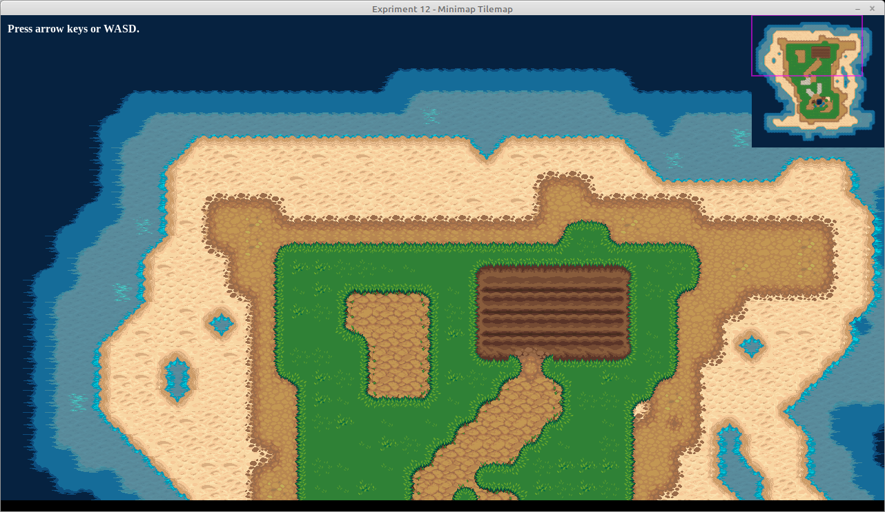

# Experiment 13 - Rect Fades

In this experiment, we'll try to fade in/out on an image by drawing over it
with masking rectangles.



You can run it from this directory with:

```sh
python3 main.py
```

If you're using Sublime Text:

1. Open the project.
1. Under Tools -> Build System, choose "Pygame - Main". You only need to pick
   the build system once, it's stored in the workspace file.
1. Choose Tools -> Build or press its shortcut (Ctrl+B).

Press Escape to exit the demo.

## Credits

This is written in Python 3, using the [PyGame](https://www.pygame.org/news) 2D
game engine.

### Graphics

* `fox n girl shadows.png` by zonked on
  [OpenGameArt](https://opengameart.org/content/girl-n-fox-n-old-man); resized
  and cropped to fit the window I'm using.
