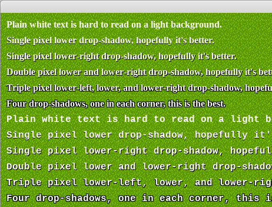

# Experiment 15 - Text Dropshadows

This experiment draws text with different dropshadows, so we can see how to
make our white text more readable on a light coloured background.



You can run it from this directory with:

```sh
python3 main.py
```

If you're using Sublime Text:

1. Open the project.
1. Under Tools -> Build System, choose "Pygame - Main". You only need to pick
   the build system once, it's stored in the workspace file.
1. Choose Tools -> Build or press its shortcut (Ctrl+B).

Press Escape to exit the demo.

## Credits

This is written in Python 3, using the [PyGame](https://www.pygame.org/news) 2D
game engine.

### Graphics

* `grass.png` - A
  [grass tile](https://opengameart.org/content/grass-tiles-0), by Invincible.
* `LiberationMono-Bold.ttf` and `LiberationSerif-Bold.ttf` - An open source
  font from the
  [liberationfonts](https://github.com/liberationfonts/liberation-fonts) repo;
  this is licensed under the
  [SIL Open Font License](https://github.com/liberationfonts/liberation-fonts/blob/master/LICENSE).
