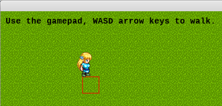

# Experiment 17 - Sprite Joystick

In this experiment, we'll take experiment *14 - Animated Sprite* and add
joystick support. Specifically for the wireless XBox gamepad I've got.



You can run it from this directory with:

```sh
python3 main.py
```

If you're using Sublime Text:

1. Open the project.
1. Under Tools -> Build System, choose "Pygame - Main". You only need to pick
   the build system once, it's stored in the workspace file.
1. Choose Tools -> Build or press its shortcut (Ctrl+B).

Press Escape to exit the demo.

## Credits

This is written in Python 3, using the [PyGame](https://www.pygame.org/news) 2D
game engine.

### Graphics

* `grass.png` - A
  [grass tile](https://opengameart.org/content/grass-tiles-0), by Invincible.
* `LiberationMono-Bold.ttf` - An open source font from the
  [liberationfonts](https://github.com/liberationfonts/liberation-fonts) repo;
  this is licensed under the
  [SIL Open Font License](https://github.com/liberationfonts/liberation-fonts/blob/master/LICENSE).
* [`LPC_Sara`](https://opengameart.org/content/lpc-sara) - Stephen "Redshrike"
  Challener as graphic artist and William.Thompsonj as contributor. Mandi Paugh
  is the original artist of Sara and creator of the
  [OGA](https://opengameart.org/) mascot.
