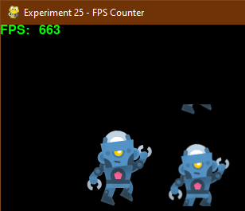

# Experiment 25 - FPS Counter

This experiment takes Experiment 1 and adds a frames/second counter to it.



You can run it from this directory with:

```sh
./python3 main.py
```

If you're using Sublime Text:

1. Open the project.
1. Under Tools -> Build System, choose "Pygame - Main". You only need to pick
   the build system once, it's stored in the workspace file.
1. Choose Tools -> Build or press its shortcut (Ctrl+B).

Press Escape to exit the demo.

## Credits

This is written in Python 3, using the [PyGame](https://www.pygame.org/news) 2D
game engine.

### Graphics

* `character_robot_jump.png` - From Kenney.nl's freely usable
  [Toon Characters 1](https://kenney.nl/assets/toon-characters-1) collection.
* `character_robot_jump-2y.png` - Kenny.nl's robot sprite, tiled using
  `montage` from ImageMagick:

  ``` sh
  montage character_robot_jump.png character_robot_jump.png -tile 1x2 -background none character_robot_jump-2y.png
  ```
