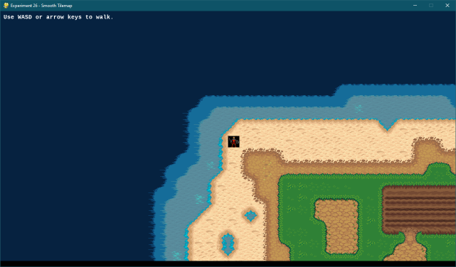

# Experiment 26 - Ultima Tiles

In this experiment, we'll display the tile map with a player avatar in the
middle of the render area. The avatar can walk around, and a default tile will
be rendered "outside" the map. This is similar to how the old *Ultima* games
(and the new *Nox Archaist*) handle maps/movement.



You can run it from this directory with:

```sh
python3 main.py
```

If you're using Sublime Text:

1. Open the project.
1. Under Tools -> Build System, choose "Pygame - Main". You only need to pick
   the build system once, it's stored in the workspace file.
1. Choose Tools -> Build or press its shortcut (Ctrl+B).

Press Escape to exit the demo.

## Credits

This is written in Python 3, using the [PyGame](https://www.pygame.org/news) 2D
game engine.

### Graphics

* `031_avatar.png` - An player avatar (The Avatar!) from Joshua Steele's
  [u4graphics](https://github.com/jahshuwaa/u4graphics) collection.
* `LiberationMono-Bold.ttf` - An open source font from the
  [liberationfonts](https://github.com/liberationfonts/liberation-fonts) repo;
  this is licensed under the
  [SIL Open Font License](https://github.com/liberationfonts/liberation-fonts/blob/master/LICENSE).
* `terrain-map-v7.png` -
  [LPC Terrains](https://opengameart.org/content/lpc-terrains) from OpenGameArt:

> "[LPC] Terrains" by bluecarrot16, Lanea Zimmerman (Sharm), Daniel Eddeland
> (Daneeklu), Richard Kettering (Jetrel), Zachariah Husiar (Zabin), Hyptosis,
> Casper Nilsson, Buko Studios, Nushio, ZaPaper, billknye, William Thompson,
> caeles, Redshrike, Bertram, and Rayane Félix (RayaneFLX). See
> `CREDITS-terrain.txt`. You MUST credit all authors with the information in
> this file, and you must link back to this page on OpenGameArt.
