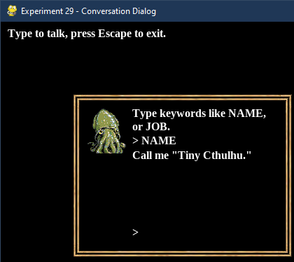

# Experiment 29 - Conversation Dialog

This experiment produces a "complete" conversation dialog, a hybrid between
the typical "portrait with text" JRPG style (like in Experiment #6) and the
free-form text input of something like *Ultima V* or *Nox Archaist*.



You can run it from this directory with:

```sh
python3 main.py
```

If you're using Sublime Text:

1. Open the project.
1. Under Tools -> Build System, choose "Pygame - Main". You only need to pick
   the build system once, it's stored in the workspace file.
1. Choose Tools -> Build or press its shortcut (Ctrl+B).

Press Escape to exit the demo.

## Credits

This is written in Python 3, using the [PyGame](https://www.pygame.org/news) 2D
game engine.

### Graphics

* `cuttlefishsmallicon.png` -
  [Cuttle Fish Portrait](https://opengameart.org/content/cuttle-fish-portrait)
  by fmunoz.geo on OpenGameArt.org.
* `LiberationSerif-Bold.ttf` - An open source font from the
  [liberationfonts](https://github.com/liberationfonts/liberation-fonts) repo;
  this is licensed under the
  [SIL Open Font License](https://github.com/liberationfonts/liberation-fonts/blob/master/LICENSE).
* `rpg_gui_v1` -
  [RPG GUI construction kit v1.0](https://opengameart.org/content/rpg-gui-construction-kit-v10)
  by Lamoot on OpenGameArt.org.
